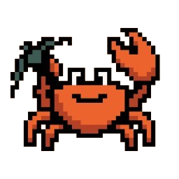

<div align="center">
  <a href="https://www.crabcraft.net">
    
  </a>

  <h1>CrabCraft</h1>

  <p>
    The website, Discord bot, Minecraft plug-ins and data platform behind the CrabCraft community.
  </p>

  <p>
    <a href="https://github.com/CrabCraftMC/CrabCraft/actions/workflows/ci.yml">
      
    </a>
    <a href="https://www.crabcraft.net">
      
    </a>
    <a href="https://www.crabcraft.net">
      
    </a>
    <a href="https://discord.crabcraft.net">
      
    </a>
  </p>

  <p>
    <a href="https://www.crabcraft.net">Website</a>
    ·
    <a href="https://map.crabcraft.net">Live map</a>
    ·
    <a href="https://wiki.crabcraft.net">Wiki</a>
    ·
    <a href="https://discord.crabcraft.net">Discord</a>
    ·
    <a href="https://api.crabcraft.net">API</a>
  </p>
</div>

---

CrabCraft is a whitelisted Minecraft survival community with considerably more
going on behind the scenes than a single server JAR. This monorepo keeps the
whole experience together: the public site, seasonal stats, community
automation, Discord workflows, Paper gameplay features, Velocity network
services and the shared data layer.

## Highlights

### A website built around the players

- **CrabCraft Wrapped** turns each season into an interactive, animated story.
  Players can revisit their playtime, travel, mining, combat, building, unusual
  stats and server-wide rankings across nine responsive scenes.
- **268 data-driven awards** cover combat, mining, building, crafting, food,
  movement, interaction and more. Every award has its own leaderboard, while
  gold, silver and bronze placements feed the overall crown ranking.
- **Rich player profiles** bring together seasonal statistics, award positions,
  advancements, login streaks, linked channels and Minecraft identity.
- **Useful Minecraft tools** include block gradients, pixel-art conversion,
  circle generation, RGB nicknames, stack and XP calculators, enchantment
  planning, beacon planning and Nether portal coordinates.
- **A live home page** combines current players, community rankings, the server
  address, applications, the map and wiki.
- **A public API** exposes live network status, online players, seasons,
  advancements, awards, streaks and leaderboards, with interactive
  documentation at [api.crabcraft.net](https://api.crabcraft.net).

Explore [Wrapped](https://www.crabcraft.net/wrapped),
[Awards](https://www.crabcraft.net/awards) or the
[leaderboard](https://www.crabcraft.net/leaderboard).

### CrabUtilities for Paper and Velocity

CrabUtilities is the server-side foundation shared across the Paper servers
and Velocity proxy. Some of its more distinctive features are:

- playable music discs and goat horns backed by a bounded yt-dlp/FFmpeg audio
  pipeline and Simple Voice Chat;
- cross-server voice state, global chat, staff chat and synchronised player
  identity;
- automatic stat collection, award evaluation, medal assignment, advancement
  tracking and login streaks;
- per-player controls for phantoms, mentions, private messages and the locator
  bar;
- Jade and AppleSkin client-protocol integrations, BlueMap sign markers and
  Xaero lifecycle support;
- nearby slime-chunk maps, custom portal behaviour, shared villager discounts,
  persistent player heads and clustered experience orbs; and
- a live, documented Velocity API used by both the website and Discord bot.

The Spigot/Paper and Velocity artefacts are built together as
`CrabUtilities.jar` and `CrabUtilities-Velocity.jar`.

### A Discord bot that runs the community

The Discord bot is more than a command collection. It coordinates the parts of
the community that need to stay reliable between restarts:

- guided whitelist applications with private channels, reminders, review
  controls and cleanup;
- a complete ticket lifecycle with participant management, moderation controls
  and transcripts;
- live award leaderboards and generated player-list/player-card views;
- player lookup and direct links into CrabCraft Wrapped;
- Minecraft punishment-role and Discord/Minecraft identity synchronisation;
- wiki update notifications and verified live-stream role monitoring; and
- a status presence driven by the same live player API used by the badge above.

## Monorepo map

| Path | Purpose | Main technology |
| --- | --- | --- |
| [`apps/web`](apps/web) | Public site, profiles, Wrapped, awards, rankings, applications and tools | Next.js 16, React 19, Tailwind CSS |
| [`apps/bot`](apps/bot) | Discord commands, applications, tickets, leaderboards and background jobs | Bun, TypeScript, discord.js |
| [`apps/minecraft/spigot`](apps/minecraft/spigot) | Paper gameplay features and integrations | Java 25, Paper |
| [`apps/minecraft/velocity`](apps/minecraft/velocity) | Proxy services, public API, network messaging and persistence | Java 25, Velocity |
| [`packages/db`](packages/db) | PostgreSQL schema, queries and award definitions | Drizzle ORM, PostgreSQL |
| [`packages/shared`](packages/shared) | Shared data types and Minecraft identity utilities | TypeScript |
| [`packages/tsconfig`](packages/tsconfig) | Shared TypeScript compiler presets | TypeScript |

PostgreSQL is the durable source of truth. Redis carries cross-server messages
and short-lived state. The Velocity API connects live Minecraft state to the
web and bot, while the shared packages keep identity and data contracts aligned.

## Getting started

### Prerequisites

- [Bun](https://bun.sh) 1.3.13 or newer
- Java 25
- Docker with Docker Compose
- PostgreSQL 18 and Redis 8, or the supplied development containers

### Set up the workspace

```sh
git clone https://github.com/CrabCraftMC/CrabCraft.git
cd CrabCraft
bun install

docker compose -f docker-compose.dev.yml up -d

cp apps/web/.env.example apps/web/.env
cp apps/bot/.env.example apps/bot/.env
cp apps/bot/config.example.json apps/bot/config.json
```

Fill in the local environment files and Discord IDs, then start the TypeScript
applications:

```sh
bun run dev
```

Runtime `.env` files, `.infisical.json` and `apps/bot/config.json` are ignored.
Never commit credentials or a production configuration.

### Build and test

```sh
# Web
bun test apps/web/tests
bun run --cwd apps/web build

# Discord bot
bun test apps/bot/tests
bun run --cwd apps/bot build

# Paper and Velocity
cd apps/minecraft
./gradlew check
```

Useful root commands:

| Command | What it does |
| --- | --- |
| `bun run dev` | Runs the TypeScript applications through Turborepo |
| `bun run build` | Builds the monorepo packages and applications |
| `bun run db:generate` | Generates Drizzle migrations |
| `bun run db:migrate` | Applies Drizzle migrations |
| `bun run db:studio` | Opens Drizzle Studio |
| `bun run seed:awards` | Seeds award definitions into PostgreSQL |

When changing PostgreSQL tables, columns, indexes, constraints or enums, update
both [`packages/db/src/schema.ts`](packages/db/src/schema.ts) and the Java/JDBC
schema under
[`apps/minecraft/velocity/src/main/java/crabcraft/net/crabUtilities/velocity/db`](apps/minecraft/velocity/src/main/java/crabcraft/net/crabUtilities/velocity/db).

### Paper configuration

CrabUtilities keeps shared server settings in `plugins/CrabUtilities/config.yml`
and feature settings in `plugins/CrabUtilities/modules/`. Missing files are
generated automatically from the bundled defaults:

| File | Settings |
| --- | --- |
| `config.yml` | Season, Redis, statistics publishing and updates |
| `modules/integrations.yml` | Accurate block placement, Jade, AppleSkin, Xaero and BlueMap |
| `modules/chat.yml` | Global chat and mentions |
| `modules/voicechat.yml` | Cross-server voice chat and CrabFM |
| `modules/media.yml` | Discs, horns and media providers |
| `modules/gameplay.yml` | Per-player gameplay controls |
| `modules/tweaks.yml` | Optional gameplay and performance tweaks |

Use `/crabutilities reload` or `/crabutilities reload all` to reload every
file. To reload one area, use `core`, `integrations`, `chat`, `voicechat`,
`media`, `gameplay` or `tweaks` as the final argument. The command reports
settings that still require a server restart.

## Contributing and security

Focused contributions are welcome. Please read
[`CONTRIBUTING.md`](CONTRIBUTING.md), add regression coverage where practical
and run the checks for every component you touch.

Please do not report vulnerabilities in a public issue or Discord channel. Use
GitHub's private security-advisory flow and follow
[`SECURITY.md`](SECURITY.md).

## Licence and provenance

CrabCraft's original code is licensed under
[GNU GPL version 3](LICENSE). Third-party components and assets retain their
respective licences and notices, as recorded in
[`THIRD_PARTY_NOTICES.md`](THIRD_PARTY_NOTICES.md).

Some CrabUtilities gameplay tweaks were inspired by
[GreenChunk](https://github.com/Hynse/GreenChunk),
[ViewDistanceTweaks](https://github.com/froobynooby/ViewDistanceTweaks) and
[Shared Villager Discounts](https://modrinth.com/plugin/shared-villager-discounts),
which are available under the MIT Licence.

Minecraft names and artwork belong to their respective owners. CrabCraft is not
an official Minecraft product and is not approved by or associated with Mojang
or Microsoft.
